# Git, Github 사용법 연습

## 📌 목차

- [🔖 목적](#-목적)
- [🔖 미리 설치하면 좋은 도구들](#-미리-설치하면-좋은-도구들)
- [🔖 Todo App 개발시, 브런치 및 커밋 예시](#-todo-app-개발시-브런치-및-커밋-예시)
- [🔖 git rebase](#-git-rebase)
- [🔖 cherry pick](#-cherry-pick)
- [🔖 브런치를 합치는 3가지 방법](#-브런치를-합치는-3가지-방법)
- [🔖 기타 참고 사항](#-기타-참고-사항)
- [🔖 참고자료](#-참고자료)

## 📌 목적

- 실무나가서 사용할 수 있는, 코드리뷰를 위한 깃(허브) 사용법 익히기
- cherry pick, rebase 등을 활용하여 커밋 및 브런치 다루기
- 특정 브런치에서 커밋 내용 나누기

## 📌 미리 설치하면 좋은 도구들

### 터미널

- [Fig](https://github.com/withfig/autocomplete): 터미널 자동완성
- [Zshell-hangul](https://github.com/gomjellie/zsh-hangul): $햣 commit -> $git commit
- [The Fuck](https://github.com/nvbn/thefuck): $gut commit -> $git commit

### VSCode

- [GitLens](https://marketplace.visualstudio.com/items?itemName=eamodio.gitlens)
- [GitEmoji](https://marketplace.visualstudio.com/items?itemName=seatonjiang.gitmoji-vscode)

## 📌 Todo App 개발시, 브런치 및 커밋 예시

- **핵심:** 커밋을 자주 활용하여 히스토리 남기기 for 코드리뷰

  ### **STEP1** 초기 세팅 및 필요없는 파일 제거시, 

  🧭 브런치 main -> **Tidy up** 
  ✏️ 커밋 메시지

  > 🔥 create-vite-app 이 만들어준 쓸데없는 파일 제거   - 이미지, css, 기본 페이지 제거함

  ### **STEP2** Todo 앱에서 Todo 메인 페이지를 구현했다면, 

  🧭 브런치 main -> **feat/main-page** 
  ✏️ 커밋 메시지

  > 🏷️ Todo Type 추가  - title, id, completed 

  > ✨ TodoList, TodoItem 컴포넌트 추가  - 기본적인 뼈대만 구현 

  > ✨ Header 추가  - 사용자가 투두를 추가할 수 있는 뷰 구현 

  > ✨ addTodo 기능 추가  - 투두가 추가되는 로직 구현 

  ### **STEP3** 깃허브 **feat/main-page** PR 생성

  - Github PR 예시 1
    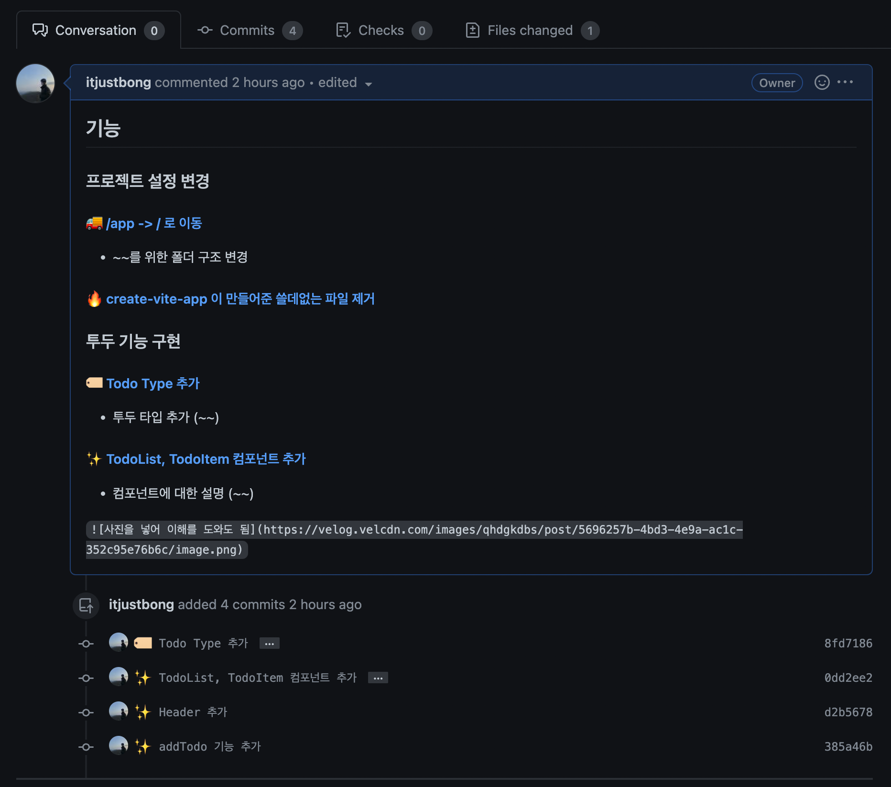
  - Github PR 예시 2 (with PR 포인트)
    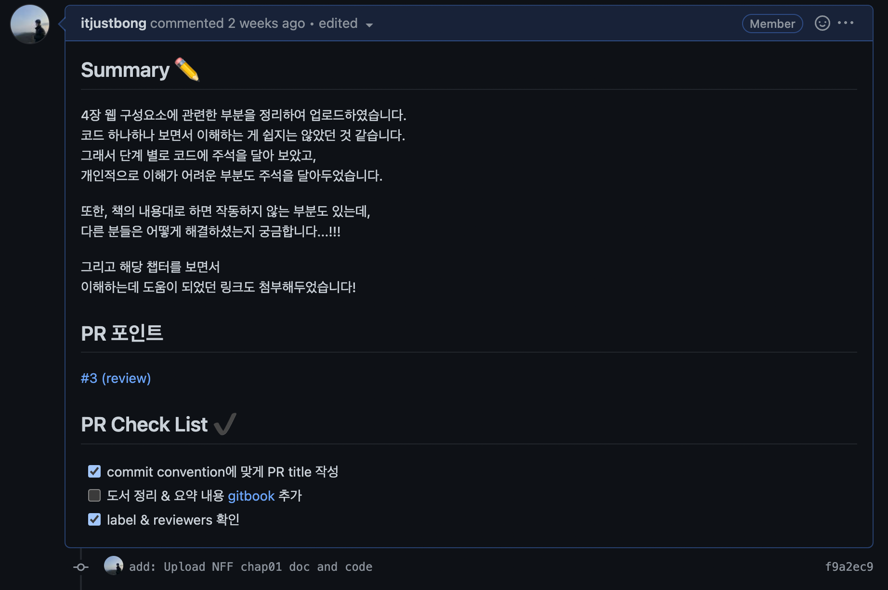
  - Comment에 담기는 내용
    - 템플릿에 따라 다르지만, 설명하고자 하는 PR 포인트를 작성하면 좋음
      - PR 포인트는 커밋 히스토리에 뜨는, 커밋 해쉬 값의 링크를 가져오면 알아서 해줌!  (커밋 메시지를 코멘트 창에 보여줌)

  ### **STEP4-커밋순서기반** 코드리뷰

  - PR 페이지에서 **커밋 탭** 활용
    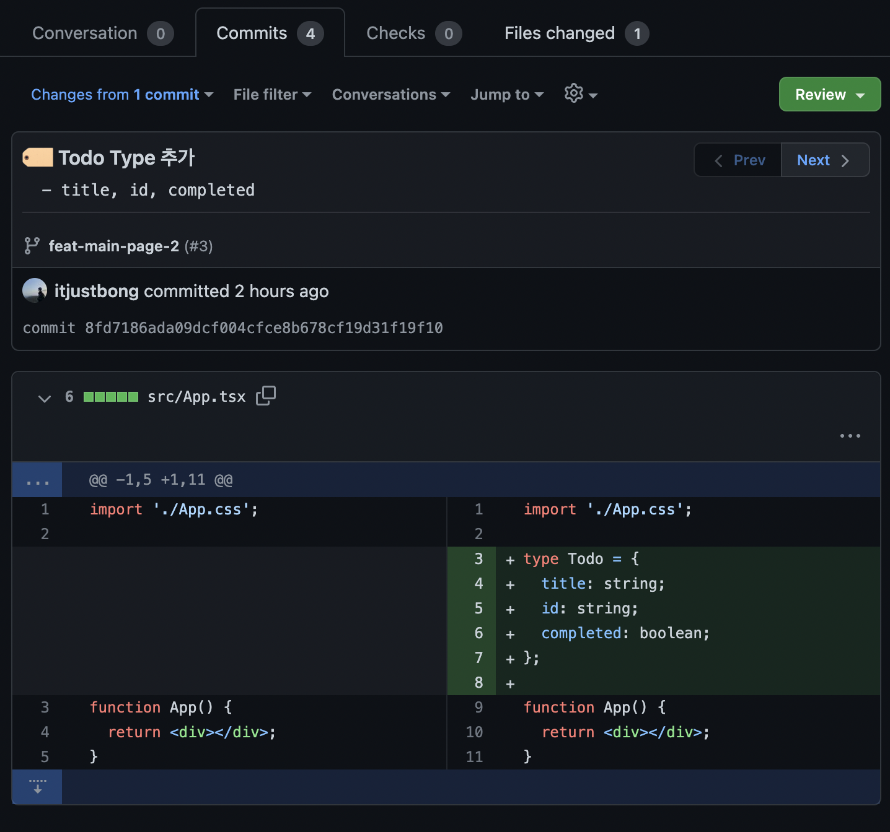
  - 커밋의 순서대로 코드리뷰가 진행되기 때문에, **커밋 순서 중요**
  - 코드리뷰 작성 시, `Start a review` 를 통해서 리뷰 코멘트
  - 다음 커밋에 대한 코드리뷰 시에, `Next` 를 통해 다음 커밋에 대한 변경 사항 확인 가능

  ### **STEP4-셀프코멘트** 코드리뷰

  - 코드 리뷰(코멘트)는 작성 순서에 따라, `Conversation`탭에 기록됨을 활용
    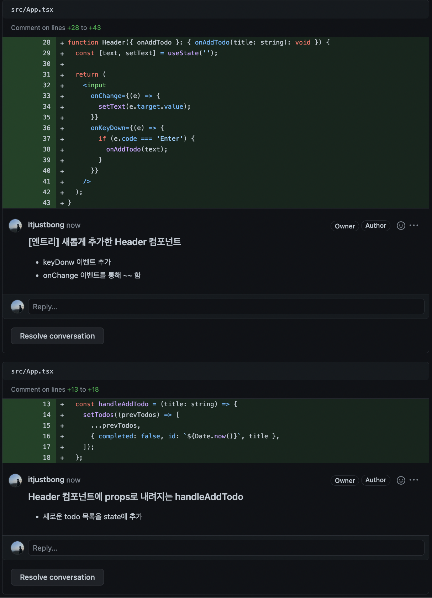
  - PR 요청자가 직접 본인의 코드를 다른 개발자가 이해하기 쉽게 코멘트를 달아 코드를 설명하는 것

  ### 기타

  - **Draft** PR
    - 나 아직 이 브런치에 대해서 작업이 끝난 것은 아님!
      수정되거나 롤백 등등 변동사항이 있을 수 있다는 것을 의미하게됨
  - GitEmoji
    - 이모지로 의도를 나타낼 수 있음
      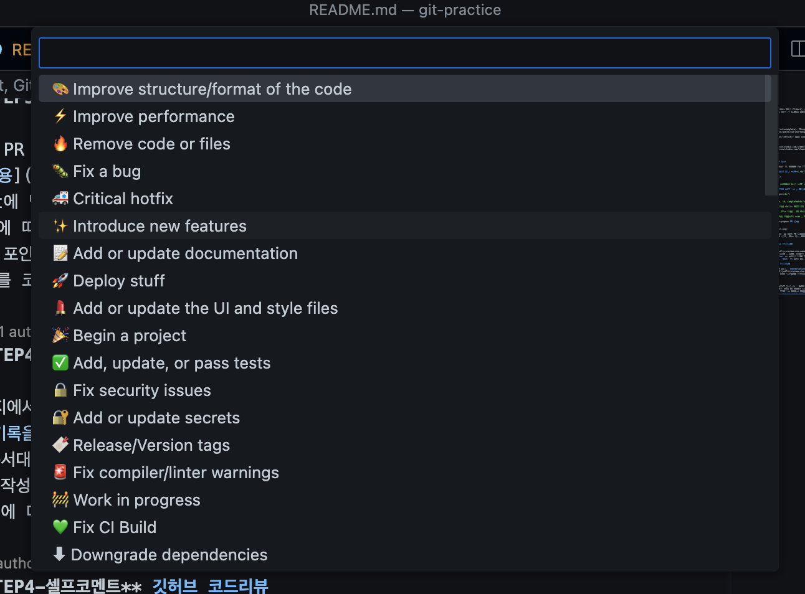
  - The Fuck - 잘 못 입력한 명령어를 자동으로 예측해서 "너 이거할라 했지?"라고 물어봄
    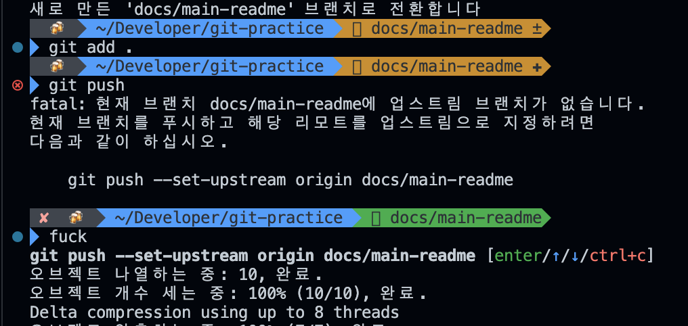
  - zsh hangul - 터미널 환경에서 한국어 입력시 자동 변환
    

## 📌 git rebase

### 활용 가능 사례

- 리모트 저장소에 올라간 커밋 변경하기

### 사전 준비

- VSCode의 확장프로그램인 GitLens가 설치되어 있다는 것을 가정
- 터미널에서 코드에디터를 vim이 아닌 VSCode로 세팅하기  
  `git config --global core.editor "code --wait"`

### rebase 명령어 및 git lens

- git rebase -i [커밋]
  - rebase 는 현재 브런치의 HEAD 포인터를 이동시킬 수 있음
    - 위 특성을 활용하여, 과거 커밋을 변경할 수 있음
  - `-i` 옵션은 `interactive`의 약자로, 말 그대로 소통(?)을 통해 작업할 수 있음
  - [커밋]의 위치에는 `수정할 커밋의 이전 커밋`을 써주면 됨 (HEAD~3 등)
  - 각각의 커밋을 확인할 수 있음(사진 첨부)
    - 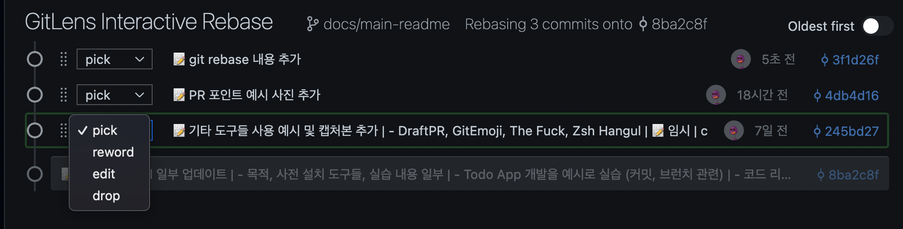
    - [명령어] [커밋 해시] [커밋 메시지] 를 순서대로 확인할 수 있음
    - 각각의 커밋에 대한 명령어 확인 가능

### rebase -i 명령어 옵션들

- pick (p)
  - 커밋을 그대로 유지
  - 커밋의 순서를 바꾸거나, 커밋 자체를 삭제할 수 있음
- reword (r)
  - 커밋 메시지 수정
  - 해당 명령어 작성 후, 편집기를 닫으면, 해당 커밋을 수정할 수 있는 편집기가 또 뜸
- edit (e)
  - 커밋의 작업 내용(커밋 메시지 포함)도 수정할 수 있도록 해줌
  - 편집기를 닫으면, 해당 커밋으로 HEAD가 옮겨짐
  - 커밋 수정 -> `git commit --amend`
  - 중간 커밋 추가 -> `git add 및 commit -m`
  - 수정 완료 -> `git rebase --continue`
- squash (s), fixup (f)

  - 해당 커밋을 이전 커밋과 합치는 것
  - 대체로, PR merge시에 squash 머지 옵션이 있음
  - squash는 커밋 메시지를 합치는 것이고, fixup은 이전의 커밋 메시지만 남김

- exec (e)
  - 리베이스 도중 실행할 쉘 커맨드를 작성할 수 있음
- break (b)
  - 해당 라인에서 rebase를 일시중지 하라는 의미
  - `pick ~~ / pick ~~ / break / pick ~~` 이런 식으로 작성하면,  break 라인에서 rebase가 일시중지 됨
  - 직전 커밋까지 리베이스를 마치게 되고,   `git rebase --continue` 명령어를 통해 다시 리베이스를 진행할 수 있음
- drop (d)
  - 해당 커밋을 명싲거으로 삭제하는 명령어
  - pick 명령어로 삭제하는 것과 동일
- merge (m)

  - merge 커밋을 만들면서 merge하는 명령어
  - 다른 브런치의 커밋 해시를 활용하면 됨
  - `merge asdf23452`

### 주의 사항

- 이미 원격에 push 된 상태라면, 주의가 필요
- 로컬에서 수정된 커밋 내용을 원격에 push 하기 위해서는, `git push -f` 명령어를 사용해야 함
  - 단, 해당 브런치에서 함께 작업하는 동료가 있다면 주의가 필요
  - ⚠️ 리베이스는 기존의 커밋을 재사용하지 않고, 내용이 같은 커밋을 만들어버림

## 📌 cherry pick

- 다른 브런치에 있는 커밋을 선택적으로 브런치에 적용시키는 명령어

### 활용 가능 상황

- 다른 브런치에 있는 커밋을 현재 브런치에 적용시키고 싶을 때
- 브런치의 커밋을 타 브런치로 옮기고 싶을 때

### 사용

- `git cherry-pick 커밋 해시`
- X 브런치에서 Y 브런치의 커밋을 가져오고 싶을 때
  - `git checkout X`
  - `git cherry-pick Y 커밋 해시`
    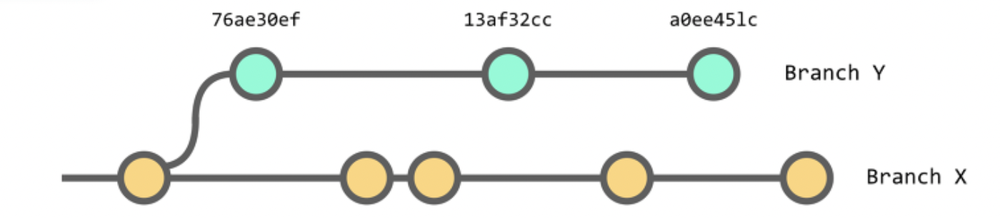
    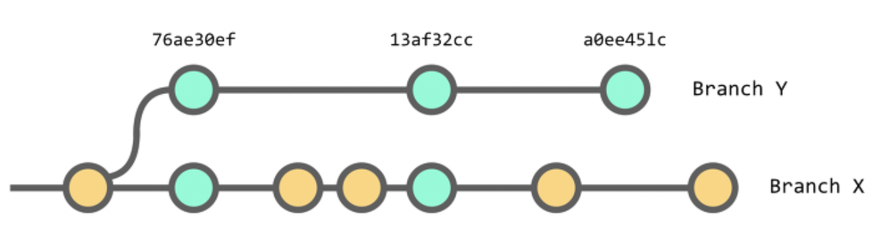
- cherry-pick은 커밋을 복사하는 것으로,   기존 브런치에도 커밋이 남아있음

## 📌 브런치를 합치는 3가지 방법

### merge

- A 브런치에서 B 브런치를 합칠때, 시간의 순서대로 커밋이 재 정렬되어 머지됨
- 또한 마지막에 MC (Merge Commit)이 하나 더 붙게 되는데, 병합에 대한 충돌이 있을 때 뒤에 Commit을 붙여 해결
  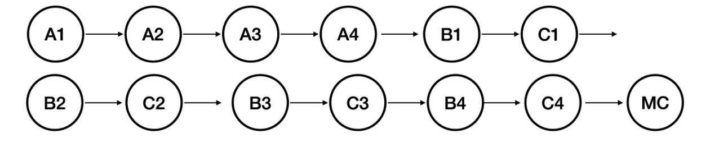

### squash & merge

- A브런치에서 B 브런치를 합칠때, B 브런치의 커밋을 squash해서 하나의 커밋으로 만들고 병합
- 만약 충돌이 있더라도 B브런치에서 MC를 만들고 전체 커밋을 squash 진행
  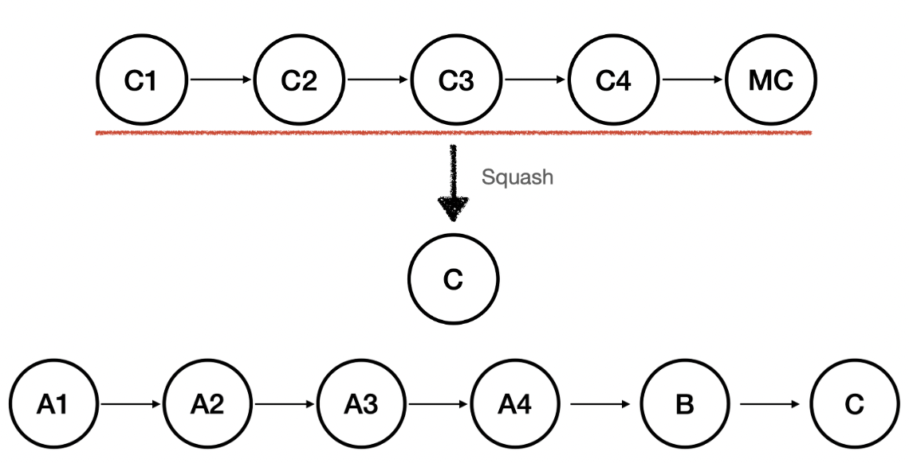

### rebase

- A 브런치에서 B 브런치를 합칠때, 커밋의 순서와 상관없이, B브런치의 커밋을 A브런치 커밋 뒤에 붙임
- MC와 같은 충돌 해결 커밋이 생기지 않는데, 이것은 B 브런치의 커밋들이 수정되기 때문
- 위와 같은 이유로 리모트에 올리기 위해서는 `git push -f`가 필요함
  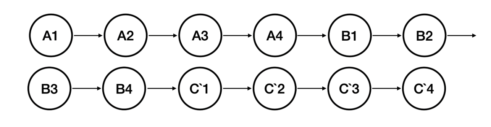

## 📌 기타 참고 사항

### git checkout이 분리됨

- ❓ 담당하는 역할이 많았음 (브런치 변경 + 작업 파일 복구)

- git checkout
  - 브런치 변경 및 작업 트리 파일 복구
- git switch
  - 브런치 변경
  - 브런치를 생성하면서 이동하려면 `git swtich -c feat`
- git restore
  - 작업 중인 파일 중 마지막 커밋에 해당하는 상태로 되돌리고자 할때 사용
  - `git restore README.md`
  - 기존에는 `git checkout -- README.md`였음

## 📌 참고자료

- [[git] merge, squash & merge 그리고 rebase의 원리에 대해서 알아보자](https://sabarada.tistory.com/196)
- [Git Rebase --Interactive 옵션 알아보기](https://wormwlrm.github.io/2020/09/03/Git-rebase-with-interactive-option.html)
- [gomjellie 특강 (?)](https://github.com/gomjellie)
- [naver FE 뉴스](https://github.com/naver/fe-news)
- [새 버전에 맞게 git checkout 대신 switch/restore 사용하기](https://blog.outsider.ne.kr/1505)
