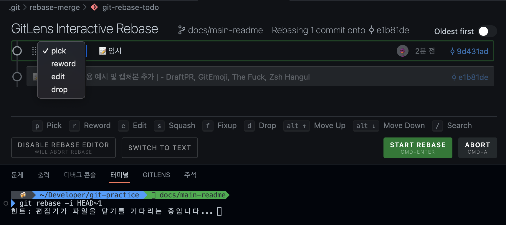

# Git, Github 사용법 연습

## 📌 목적

- 실무나가서 사용할 수 있는, 코드리뷰를 위한 깃(허브) 사용법 익히기
- cherry pick, rebase 등을 활용하여 커밋 및 브런치 다루기
- 특정 브런치에서 커밋 내용 나누기

## 📌 미리 설치하면 좋은 도구들

### 터미널

- [Fig](https://github.com/withfig/autocomplete): 터미널 자동완성
- [Zshell-hangul](https://github.com/gomjellie/zsh-hangul): $햣 commit -> $git commit
- [The Fuck](https://github.com/nvbn/thefuck): $gut commit -> $git commit

### VSCode

- [GitLens](https://marketplace.visualstudio.com/items?itemName=eamodio.gitlens)
- [GitEmoji](https://marketplace.visualstudio.com/items?itemName=seatonjiang.gitmoji-vscode)

## 📌 실습

### Todo App 개발시, 브런치 및 커밋 예시

- **핵심:** 커밋을 자주 활용하여 히스토리 남기기 for 코드리뷰

  #### **STEP1** 초기 세팅 및 필요없는 파일 제거시, 

  🧭 브런치 main -> **Tidy up** 
  ✏️ 커밋 메시지

  > 🔥 create-vite-app 이 만들어준 쓸데없는 파일 제거   - 이미지, css, 기본 페이지 제거함

  #### **STEP2** Todo 앱에서 Todo 메인 페이지를 구현했다면, 

  🧭 브런치 main -> **feat/main-page** 
  ✏️ 커밋 메시지

  > 🏷️ Todo Type 추가  - title, id, completed 

  > ✨ TodoList, TodoItem 컴포넌트 추가  - 기본적인 뼈대만 구현 

  > ✨ Header 추가  - 사용자가 투두를 추가할 수 있는 뷰 구현 

  > ✨ addTodo 기능 추가  - 투두가 추가되는 로직 구현 

  #### **STEP3** 깃허브 **feat/main-page** PR 생성

  - Github PR 예시 1
    
  - Github PR 예시 2 (with PR 포인트)
    
  - Comment에 담기는 내용
    - 템플릿에 따라 다르지만, 설명하고자 하는 PR 포인트를 작성하면 좋음
      - PR 포인트는 커밋 히스토리에 뜨는, 커밋 해쉬 값의 링크를 가져오면 알아서 해줌!  (커밋 메시지를 코멘트 창에 보여줌)

  #### **STEP4-커밋순서기반** 코드리뷰

  - PR 페이지에서 **커밋 탭** 활용
    
  - 커밋의 순서대로 코드리뷰가 진행되기 때문에, **커밋 순서 중요**
  - 코드리뷰 작성 시, `Start a review` 를 통해서 리뷰 코멘트
  - 다음 커밋에 대한 코드리뷰 시에, `Next` 를 통해 다음 커밋에 대한 변경 사항 확인 가능

  #### **STEP4-셀프코멘트** 코드리뷰

  - 코드 리뷰(코멘트)는 작성 순서에 따라, `Conversation`탭에 기록됨을 활용
    
  - PR 요청자가 직접 본인의 코드를 다른 개발자가 이해하기 쉽게 코멘트를 달아 코드를 설명하는 것

  #### 기타

  - **Draft** PR
    - 나 아직 이 브런치에 대해서 작업이 끝난 것은 아님!
      수정되거나 롤백 등등 변동사항이 있을 수 있다는 것을 의미하게됨
  - GitEmoji
    - 이모지로 의도를 나타낼 수 있음
      
  - The Fuck - 잘 못 입력한 명령어를 자동으로 예측해서 "너 이거할라 했지?"라고 물어봄
    
  - zsh hangul - 터미널 환경에서 한국어 입력시 자동 변환
    

### 리모트 저장소에 올라간 커밋 변경하기

- VSCode의 확장프로그램인 GitLens가 설치되어 있다는 것을 가정
- 터미널에서 코드에디터를 vim이 아닌 VSCode로 세팅하기  
  `git config --global core.editor "code --wait"`

#### **STEP1** rebase 명령어 및 git lens

- git rebase -i HEAD^1
  
- 위 사진의 `git-lens` 화면에서 커밋 내역을 확인, 수정할 수 있음
  - 작성 중...
